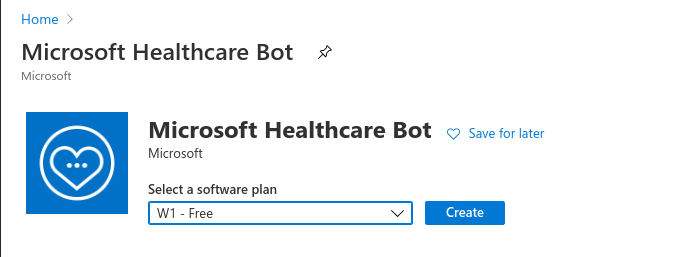
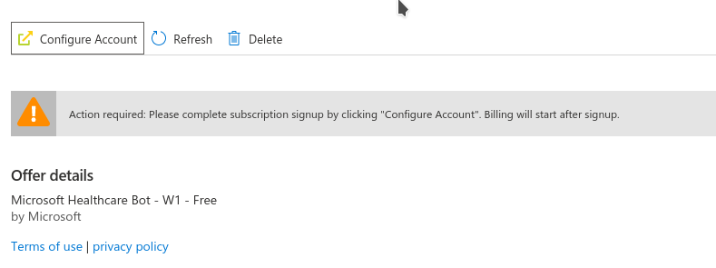
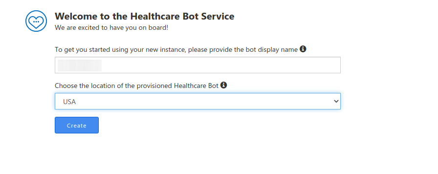

# Deployment

## 1. Create Healthcare Bot SaaS Application

 Click on the "GET IT NOW" button

Navigate to the [marketplace]([Marketplace](https://azuremarketplace.microsoft.com/en-us/marketplace/apps/microsoft-hcb.microsofthealthcarebot?tab=Overview)
) and create your Healthcare Bot application

Once redirected to the Azure Portal, select the Plan and click on the "Create" button

On the next page, give it a resource name. You also need to select the Azure subscription that will be used to charge the cost of the bot.

Notice that after the creation of this resource, you will not be able to find it under any of the Resource Groups. To see all your SaaS Applications, make sure you have added a "Software as a Service (SaaS)" blade to the navigation panel as shown below.

## 2. Configuring your Healthcare Bot SaaS application

Locate the newly created resource and click it. Click the "Configure Account" button as shown. This will take you to the Healthcare Bot Owner portal where you can continue creating the actual Healthcare Bot resources.

At this point you can assign a name to the bot. You will have default name given by you  when you created the SaaS resource. This name will be used to generate a globally unique name that will identify this instance of the bot. Also, select the location of the provisioned resources. We currently support USA and EU locations. Click the "Create" button.

Next step: [Configure Healthcare Bot for Microsoft Teams](../portal/portal.md)